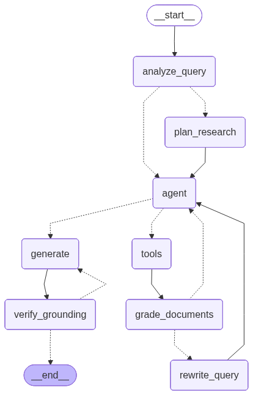

# 🏎️ Agentic RAG — Formula 1 (LangGraph)

An **Agentic RAG** system that answers simple and complex questions about Formula 1
from a knowledge base built from Wikipedia (regulations, teams, drivers, circuits,
technology/engine, strategy, and every season from 2005 to 2025). The reasoning
graph is **written entirely by hand with LangGraph** — without `create_agent` — to
control every stage: analysis, planning, retrieval, self-correction and
anti-hallucination verification.

📄 **[Read the full project report (PDF)](reports/rapport.pdf)** — motivation, design
decisions, the problems I hit and how I solved them, and the evaluation results.



---

## 1. What the system does

- **Bilingual FR / EN**: questions and answers in French or English, over a mostly
  English corpus (cross-lingual retrieval).
- **Agentic**: the agent decides which tools to call, judges whether the retrieved
  documents are relevant, rewrites its query on failure, and verifies that its
  final answer is grounded in the sources.
- **Memory**: each conversation has a thread (`thread_id`); the agent resolves
  implicit references from one turn to the next.
- **Free**: LLM via a free key (Groq / Google Gemini) or local (Ollama).
  Embeddings run 100% locally (ONNX, no key).

## 2. Graph architecture

```
        ┌───────────────┐
        │ analyze_query │  language · standalone question · simple/complex
        └───────┬───────┘
       simple   │   complex
         ┌──────┴───────┐
         ▼              ▼
       agent  ◄──  plan_research      break complex question into sub-questions
         │  ▲
  tool   │  │  documents relevant
  call   ▼  │
       tools │
         │   │
         ▼   │
  grade_documents ──(off-topic)──► rewrite_query ──┐
         │                                         │
   (relevant → agent)                              │
         │  ◄──────────────────────────────────────┘
         ▼  (no more tools to call)
      generate ◄──(answer not grounded)──┐
         │                               │
         ▼                               │
   verify_grounding ────────────────────┘
         │
         ▼
        END
```

| Node | Role |
|------|------|
| `analyze_query` | detects language, rewrites the question as standalone (memory), routes simple/complex |
| `plan_research` | decomposes a complex question into atomic sub-questions |
| `agent` | reasons and selects tools (hand-written ReAct loop, budgeted) |
| `tools` | executes the tools and writes retrieved documents into the state |
| `grade_documents` | judges the relevance of the retrieved context (CRAG-style self-correction) |
| `rewrite_query` | rewrites the query after a retrieval failure |
| `generate` | writes the grounded answer, with `[SOURCE n]` citations |
| `verify_grounding` | checks for hallucination, regenerates if needed |

The state, memory and conditional routing are detailed in [`src/graph/`](src/graph/).

## 3. Agent tools

| Tool | Purpose |
|------|---------|
| `rechercher_documents` | hybrid search (dense + BM25) over the whole corpus |
| `rechercher_par_categorie` | filtered search (regulations, driver, circuit, strategy…) |
| `comparer_entites` | retrieves facts about two entities to compare, in parallel |
| `inventaire_corpus` | lists available categories and documents |
| `calculer_points_championnat` | deterministic points calculation (official scale) |

## 4. Installation

```bash
cd f1_agentic_rag
python3 -m venv .venv
source .venv/bin/activate
pip install -r requirements.txt

cp .env.example .env
# edit .env: choose LLM_PROVIDER and fill in the matching key
```

Get a **free** key:
- Groq: <https://console.groq.com/keys>
- Google Gemini: <https://aistudio.google.com/apikey>
- Ollama (local, no key): <https://ollama.com>

## 5. Usage

```bash
# 1. Build the knowledge base (Wikipedia, no key)
python scripts/01_build_corpus.py

# 2. Chunk + index (downloads the embedding model on first run)
python scripts/02_index.py

# 3. Export the graph visualization
python scripts/03_visualize_graph.py

# 4. Chat with the agent
python scripts/chat.py            # add --trace to see the reasoning

# 5. Run the evaluation (20 questions + metrics + reports)
python scripts/04_evaluate.py

# 6. Build the PDF report (injects the evaluation results)
python scripts/05_build_report.py
```

## 6. Evaluation

`scripts/04_evaluate.py` runs 10 simple and 10 complex (bilingual) questions,
then measures:

- **latency** end-to-end per question;
- **relevance of retrieved documents** (`hit@k`, `MRR`);
- **answer quality** scored by an LLM judge (faithfulness, completeness, clarity).

Outputs: `reports/evaluation.csv` (detail) and `reports/evaluation.md` (summary).

## 7. Project structure

```
f1_agentic_rag/
├── scripts/            # numbered entry points (corpus → index → chat → eval → report)
├── src/
│   ├── config.py       # central configuration
│   ├── corpus/         # knowledge base construction
│   ├── ingestion/      # embeddings, chunking, vectorstore, hybrid retriever
│   ├── llm/            # model factory (Groq / Gemini / Ollama)
│   ├── tools/          # agent tools
│   ├── graph/          # state, nodes, edges, graph assembly
│   └── evaluation/     # question set, metrics, judge, harness
├── reports/            # evaluation results + figures + PDF report
└── requirements.txt
```

## 8. Notable technical choices

- **Embeddings via FastEmbed (ONNX)** instead of PyTorch: PyTorch no longer ships
  a wheel for macOS x86_64 / Python 3.13, which made the project uninstallable.
  ONNX is also lighter and faster on CPU.
- **Hybrid retrieval + RRF**: dense search alone fails on acronyms (DRS, ERS) and
  proper nouns; BM25 catches them. Reciprocal Rank Fusion combines both without
  normalizing heterogeneous scores.
- **Per-document chunk cap**: the corpus is unbalanced (the "Formula 1" page alone
  is ~390 chunks); without a cap, one generalist document monopolizes the top-k.
- **Year boost**: with 22 near-identical seasons (2005–2025), a "2010 champion"
  question could return another year; a deterministic bonus re-anchors the search
  on the correct year.
- **Model split**: the reasoner uses a large model (Llama 3.3 70B); the relevance
  grader, grounding verifier and judge are routed to a light model (Llama 3.1 8B) —
  cheaper in tokens and subject to separate rate limits, which avoids exhausting
  the free quota on high-volume loops.
- **Robustness**: every LLM-calling node catches errors (429 quota, malformed
  output) and degrades gracefully (fail-open) instead of crashing; the evaluation
  saves its results incrementally.
